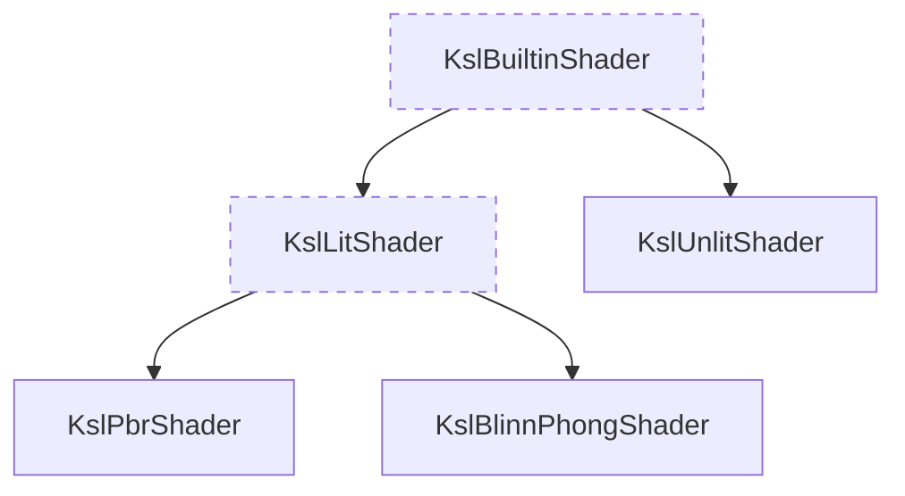

# Shading
{: .fs-9 .no_toc }

Shaders (sometimes also called materials) are required to draw objects to the screen (or into a texture). 
kool comes with a set of general purpose shaders as well as its own shading language to write custom shaders.
{: .fs-6 .fw-300 }

## Table of contents
{: .no_toc .text-delta }

1. TOC
{:toc}

---

## Builtin shaders

kool's builtin shaders provide easy-to-use materials suitable for most standard use-cases.



Currently, there are three different builtin shaders available (described in detail further below):
- [KslPbrShader](#kslpbrshader)
- [KslBlinnPhongShader](#kslblinnphongshader)
- [KslUnlitShader](#kslunlitshader)

{: .note }
All builtin shaders are written in [KSL](#ksl---kool-shading-language), the same DSL you can use to write your own custom shaders.

All builtin shaders have a variety of configuration options, which you can use to customize their behavior. Shaders are
typically created by a factory function, which provides the configuration API:

```kotlin
val myShader = KslPbrShader {
    color { uniformColor(MdColor.BLUE.toLinear()) }
}
```

{: .important }
After creation, all shaders are compiled and executed directly on the GPU. This means that, after creation, basic configuration settings cannot
be changed anymore. It is however possible to change assigned values later on (textures, colors, etc.).

Depending on their type, shaders share several configuration options.

### Common options

Apply to all builtin shaders.

{: .note }
The list of configuration options presented here is not exhaustive. There are a few more rather advanced
options used for animations, morphing, etc. Try digging into the code in case you want to find out more.

### `color { ... }`
{: .no_toc }

Configures the color source. Color sources can be:
- `textureColor()` - Use a texture. Requires the mesh to include texture coordinates.
- `vertexColor()` - Use a vertex attribute. Requires the mesh to include per-vertex color values.
- `instanceColor()` - Use an instance attribute. Only applicable to instanced meshes.
- `uniformColor()` - Use a single uniform color for the entire mesh. 
- `constColor()` - Similar to `uniformColor()` but hardcodes the color value in the shader code making it immutable.

{: .note }
Most shaders work with linear color space, while common color constants usually assume sRGB color space. Mismatching
color spaces can result in awkward looking colors (usually either very dull or dark and oversaturated). Use `Color.toLinear()` /
`Color.toSrgb()` in such a case.

It is also possible to combine multiple color sources using various blend modes:

```kotlin
color {
    // Use a texture as base color
    textureColor(someTexture)
    // Tint the texture by multiplying another color to it
    uniformColor(MdColor.PINK.toLinear(), blendMode = ColorBlockConfig.BlendMode.Multiply)
}
```

### `pipeline { ... }`
{: .no_toc }

*Optional block*

Configures various pipeline settings, which affect how the object is drawn into the scene.
In most cases the default values should be fine and the pipeline block can be omitted.

- `blendMode` - Enables / disables alpha-blending. Defaults to `BlendMode.BLEND_MULTIPLY_ALPHA`
- `cullMethod` - Determines which triangle sides should be culled. Defaults to `BlendMode.CULL_BACK_FACES`
- `depthTest` - Determines the depth testing function. Defaults to `DepthCompareOp.LESS_EQUAL`
- `isWriteDepth` - Enables / disables updating the depth buffer when the object is drawn.

A common case is to disable depth-testing for a certain object. This can be achieved by setting
`depthTest = DepthCompareOp.ALWAYS` and `isWriteDepth = false`.

### `vertices { ... }`
{: .no_toc }

*Optional block*

Configures various vertex-transform related settings.

- `isInstanced` - Enables mesh instancing for this shader.
- `displacement()` - Can be used to provide a displacement texture to add geometry detail.

### Lit shader options

The lit shader options are all related to lighting and, hence, don't apply to `KslUnlitShader`.

### `normalMapping { ... }`
{: .no_toc }

*Optional block*

Can be used to enable and set a material specific normal map (sometimes also referred to as bump map).

### `shadow { ... }`
{: .no_toc }

*Optional block*

Can be used to enable and set one or more shadow maps.

### `ao { ... }`
{: .no_toc }

*Optional block*

Configures ambient occlusion (AO). AO comes in two flavors: First, materials can have a static ao map (similar to
other material properties like color or a normal map). Second, in case screen-space ambient occlusion (SSAO) is enabled,
the SSAO map contains the dynamic scene-specific AO component.

Both AO types can be configured in this block via `materialAo { ... }` and `enableSsao()` respectively.

### `emission { ... }`
{: .no_toc }

*Optional block*

Can be used to enable and set a material specific emission map.

### KslPbrShader

[`KslPbrShader`][KslPbrShader] provides a general purpose shader for lit materials following the
[physical based rendering][PBR theory] (PBR) approach. PBR shaders
try to approximate the physical properties of real materials more closely than older shading
techniques like, e.g., Blinn-Phong shading. This typically results in a more realistic look
of rendered objects. On the downside PBR shading is quite a bit more expensive than simpler
shading models. So, in case you are targeting low-end and / or mobile devices, you should consider
using a [Blinn-Phong shader](#kslblinnphongshader) instead.

kool's PBR shader follows the metallic workflow, meaning it has two basic material properties:

- **Roughness**: A value ranging from 0 (very smooth) to 1 (very rough).
- **Metallic**: A value ranging from 0 (dielectric, i.e. non-metallic, e.g. plastic) to 1 (pure metal).

To assign a PBR shader to a mesh you can use the corresponding factory function:

```kotlin
mesh.shader = KslPbrShader {
    color { /* color config */ }

    // Use constant roughness / metallic values
    metallic(0f)
    roughness(0.5f)

    // or use textures providing the roughness / metallic values
    roughness { textureProperty(materialRoughnessMap) }
    // You can also use a uniform property, which allows changing the property
    // after shader construction
    metallic { uniformProperty(1f) }

    // Optionally, you can set additional settings
    normalMapping { setNormalMap(materialNormalMap) }
    shadow { addShadowMap(someShadowMap) }
    ao {
        materialAo { textureProperty(materialAoMap) }
        enableSsao(sceneSpaceAoMap)
    }
}
```

### KslBlinnPhongShader

[`KslBlinnPhongShader`][KslBlinnPhongShader] provides a general purpose shader for lit materials following the
traditional [Blinn-Phong][Blinn-Phon theory] method. It is less sophisticated than PBR shading but quite a bit
faster making it more suitable for low-end and / or mobile devices.

`KslBlinnPhongShader` has three specific material properties:

- **Shininess**: A value ranging from 0 to infinity, describing how shiny the surface is.
- **Specular strength**: A multiplier (typically ranging from 0 to 1) affecting the strength of the specular lighting term.
- **Specular color**: A color value, which is multiplied to the specular lighting term (white by default).

Assigning a Blinn-Phong shader works similar to PBR shaders:

```kotlin
mesh.shader = KslBlinnPhongShader {
    color { /* color config */ }

    // Use constant roughness / metallic values
    shininess(50f)
    specularStrength(1f)

    // or use textures providing the roughness / metallic values
    shininess { textureProperty(materialShininessMap) }
    // You can also use a uniform property, which allows changing the property
    // after shader construction
    specularStrength { uniformProperty(1f) }

    // Optionally, you can set additional settings
    normalMapping { setNormalMap(materialNormalMap) }
    shadow { addShadowMap(someShadowMap) }
    ao {
        materialAo { textureProperty(materialAoMap) }
        enableSsao(sceneSpaceAoMap)
    }
}
```

### KslUnlitShader

[`KslUnlitShader`][KslUnlitShader] is a general purpose shader, that does not incorporate any lighting model.
Instead, the material source color is forwarded more or less unmodified by the fragment shader (apart from
optional color-space conversion).

Unlit shaders are typically used for UI overlays, navigation grids, wireframes etc.

Assigning an unlit shader works similar to lit shaders. Since there are no light-related properties, you often
only set the color source:

```kotlin
mesh.shader = KslUnlitShader {
    color { /* color config */ }
}
```

## KSL - kool shading language

{: .warning }
KSL is quite powerful and offers pretty much the same feature set as GLSL, although the syntax is sometimes a
bit more complicated. However, **documentation is still very much incomplete**. In case you want to dive deep you
should take a look at the source code of the builtin shaders, to get an idea about how things work.

### Why KSL

Maintaining a dedicated DSL to write arbitrarily complex shaders might seem a bit overkill at first. However,
the benefit with this is that shader code also is multi-platform:

Besides OpenGL, kool also has a WebGPU backend, which requires shaders to be written in WGSL. Although WGSL
follows the same concepts as GLSL (and all the other shader languages as well), the syntax is very different.
By using a DSL, the same shader logic can be transformed into GLSL and WGSL. No need to maintain multiple shader
sources for different backends! This approach should even work for more shading languages, like, e.g., metal.

### Example KSL shader

Here's a minimal example for a custom KSL shader:

```kotlin
val customShader = KslShader("Hello world shader") {
    val interStageColor = interStageFloat4()
    vertexStage {
        main {
            val mvp = mvpMatrix()
            val localPosition = float3Var(vertexAttribFloat3(Attribute.POSITIONS))
            outPosition set mvp.matrix * float4Value(localPosition, 1f.const)
            interStageColor.input set vertexAttribFloat4(Attribute.COLORS)
        }
    }
    fragmentStage {
        main {
            colorOutput(interStageColor.output)
        }
    }
}
```

If you ever wrote a shader before the structure should be familiar: The shader consists of a vertex
stage (responsible for projecting the individual mesh vertices onto the screen) and a fragment stage (responsible
for computing the output-color for each pixel covered by the mesh). This example shader is almost as simple as a valid
shader can be: It uses a pre-multiplied MVP matrix to project the vertex position attribute to the screen. Moreover,
the color attribute is taken from the vertex input and forwarded to the fragment shader via `interStageColor`. The
fragment stage then simply takes the color from `interStageColor` and writes it to the screen.

A little more complex example is available in the [HelloKsl] demo.

### Compute shaders

So far, this chapter discussed only regular shaders used for drawing geometry. A different kind of shaders are compute shaders,
which can be used to offload compute workload to the GPU. kool and KSL also support compute shaders. Examples are available
in the [HelloCompute] and [Bee][BeeShader] demos.

## Deferred shading

{: .warning }
The deferred rendering pipeline is somewhat deprecated at the moment and will probably change significantly
in the future. Documentation is therefore very limited.

So far, all discussed shaders use traditional forward rendering. Another option to do the rendering is deferred
shading which can be cheaper and allows for more advanced lighting effects.

To use deferred shading, you need to use an appropriate shader. Currently, the only builtin option is [`DeferredKslPbrShader`][DeferredKslPbrShader], which has mostly the same configuration options like the
forward-rendering version described [above](#kslpbrshader).

Examples using deferred shading are [DeferredDemo], [ReflectionDemo] and the
[VehicleDemo]

[KslPbrShader]: https://github.com/kool-engine/kool/blob/main/kool-core/src/commonMain/kotlin/de/fabmax/kool/modules/ksl/KslPbrShader.kt
[PBR theory]: https://learnopengl.com/PBR/Theory
[KslBlinnPhongShader]: https://github.com/kool-engine/kool/blob/main/kool-core/src/commonMain/kotlin/de/fabmax/kool/modules/ksl/KslBlinnPhongShader.kt
[Blinn-Phon theory]: https://en.wikipedia.org/wiki/Blinn%E2%80%93Phong_reflection_model
[DeferredKslPbrShader]: https://github.com/kool-engine/kool/blob/main/kool-core/src/commonMain/kotlin/de/fabmax/kool/pipeline/deferred/DeferredPbrShader.kt
[KslUnlitShader]: https://github.com/kool-engine/kool/blob/main/kool-core/src/commonMain/kotlin/de/fabmax/kool/modules/ksl/KslUnlitShader.kt
[HelloKsl]: https://github.com/kool-engine/kool/blob/main/kool-demo/src/commonMain/kotlin/de/fabmax/kool/demo/helloworld/HelloKsl.kt
[DeferredDemo]: https://github.com/kool-engine/kool/blob/main/kool-demo/src/commonMain/kotlin/de/fabmax/kool/demo/DeferredDemo.kt
[ReflectionDemo]: https://github.com/kool-engine/kool/blob/main/kool-demo/src/commonMain/kotlin/de/fabmax/kool/demo/ReflectionDemo.kt
[VehicleDemo]: https://github.com/kool-engine/kool/tree/main/kool-demo/src/commonMain/kotlin/de/fabmax/kool/demo/physics/vehicle
[HelloCompute]: https://github.com/kool-engine/kool/blob/main/kool-demo/src/commonMain/kotlin/de/fabmax/kool/demo/helloworld/HelloCompute.kt
[BeeShader]: https://github.com/kool-engine/kool/blob/main/kool-demo/src/commonMain/kotlin/de/fabmax/kool/demo/bees/GpuBees.kt